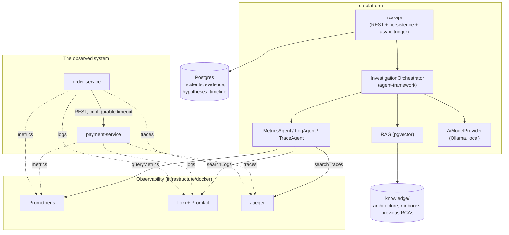
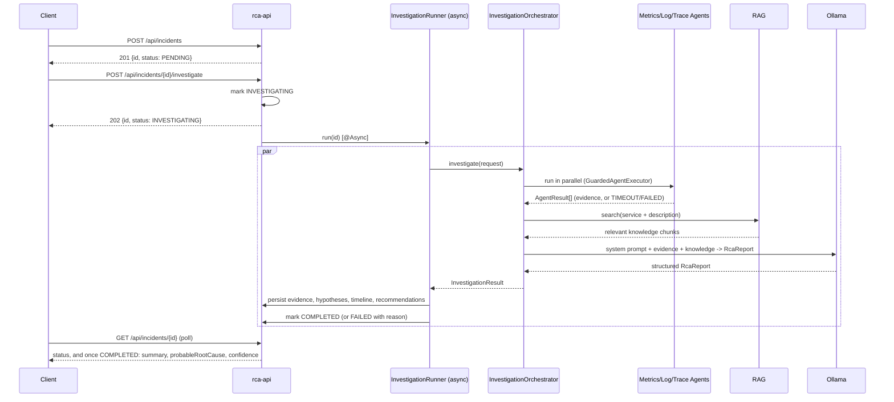
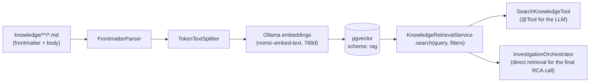
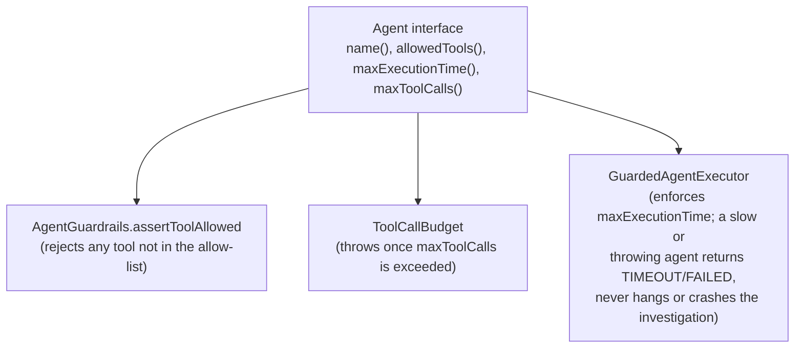

# Architecture

This describes what's actually built (the MVP golden path), not the full 64-section
spec — see `plan.md` for the backlog and the reasoning behind every deviation from the
spec's literal structure.

## Overall system

## Investigation flow

## RAG pipeline

Live operational data (Prometheus/Loki/Jaeger) and enterprise knowledge (RAG) are
deliberately separate paths that only meet inside the LLM's prompt — RAG never serves
live metrics/logs, and the tools never serve architecture docs. This is the spec's
"LIVE DATA + RAG CONTEXT + AGENT TOOL RESULTS + LLM REASONING = EVIDENCE-BASED RCA"
principle (section 63), and it's why the knowledge search in the final reasoning step
is unfiltered by service — the Payment runbook is relevant evidence for an
order-service incident, and filtering it out by service would have hidden it.

## Agent guardrails

Every agent declares, in code, exactly what it's allowed to do:

`MetricsAgent`/`LogAgent`/`TraceAgent` call their tool(s) deterministically rather than
through their own LLM tool-calling loop — see `plan.md`'s Phase 6 entry for why. The
one LLM call in the whole flow is `InvestigationOrchestrator`'s final reasoning step,
which does use real Spring AI tool-calling for `SearchKnowledgeTool` where relevant
(and is verified live in `agent-framework`'s tests to actually invoke tools rather than
hallucinate answers).

## Deliberate deviations from the literal spec structure

1. **2 processes, not ~20 modules.** Section 5's folder tree implies one Maven module
   per agent/tool/concern. Agents and tools live as packages inside `agent-framework`
   instead — see `plan.md`'s "Folder structure note".
2. **rca-api and rca-orchestrator combined for the MVP**, using an in-process `@Async`
   call instead of Kafka for the investigate trigger (spec section 44 explicitly allows
   "Kafka or another suitable asynchronous mechanism"). The orchestration logic lives
   in `agent-framework` independent of both, so splitting it out later is additive.
3. **Agents call tools deterministically**, not through their own LLM loop — the
   agentic reasoning happens once, at the orchestrator level, over all agents' combined
   evidence. See `plan.md` Phase 6.
